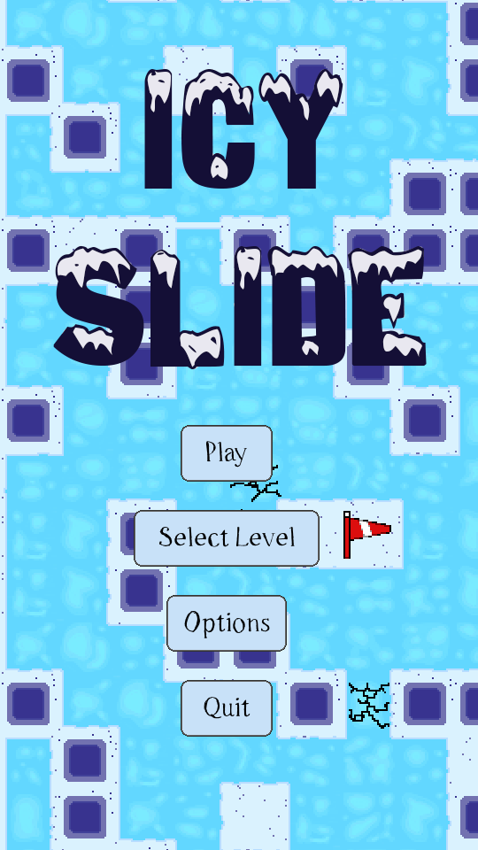
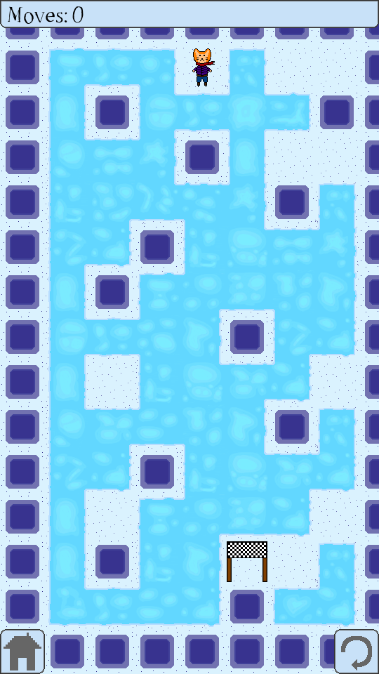
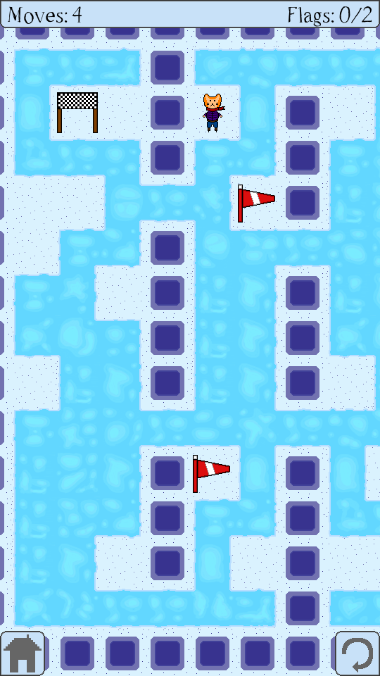
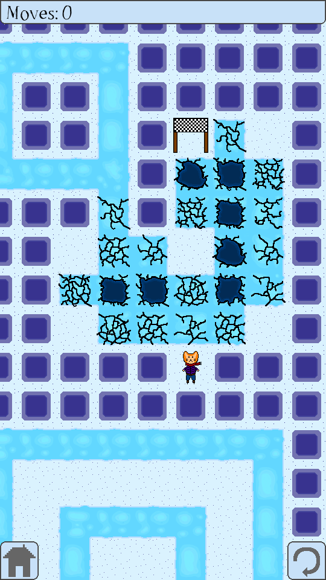

# IcySlide - A Puzzle Game
## Developed by Jason Captor and Nina Captor

IcySlide is a mobile puzzle game where you control an ice skater trying to reach a goal. Inspired by the Ice-type gyms and caves in old Pokemon games.
### How To Play
Use arrow keys or WASD to slide from snow patch to snow patch until you reach the goal! Ice is slippery, and once you are moving on ice you will not stop until you hit a rock or snow.

Game is a work in progress, and is actively in development.

### Screenshots

